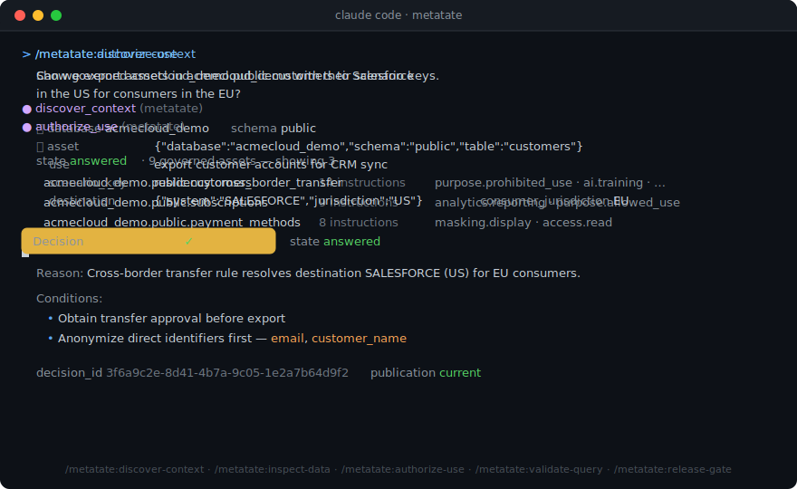

# Metatate Claude Plugins

Bring Metatate's structured context and decision layer into Claude Code.



Metatate gives agents structured, machine-readable context for data workflows:
data meaning, business logic, policies, lineage, access rules, runtime
conditions, and decision evidence. This marketplace ships two Claude Code
plugins that let Claude query that context through Metatate's MCP servers.

## New To Metatate? Start Free

You don't need an existing Metatate deployment to try this:

1. **Create a free Metatate Cloud account** at
   [app.getmetatate.com/sign-up?ref=claude-plugins](https://app.getmetatate.com/sign-up?ref=claude-plugins)
   and create a workspace — the free plan covers everything on this page.
2. On the new workspace's dashboard, follow the **"New here?" banner → Load
   the demo**, then click **Load the AcmeCloud demo**. It publishes a governed
   demo domain (five tables, three policies, one live publication), so Claude
   gets real decisions immediately.
3. Install the `metatate` plugin and connect it — see
   [Metatate Cloud (`metatate`)](#metatate-cloud-metatate) below.

Already running Metatate? Pick the plugin that matches your deployment.

## Which Plugin Do I Install?

| You run Metatate as | Install | MCP server | Auth |
| --- | --- | --- | --- |
| Metatate Cloud (hosted workspace) | `metatate` | Metatate Cloud endpoint (`<mcp-server-url>/mcp`) | Workspace access token (bearer) |
| Snowflake Native App | `metatate-snow` | Snowflake-managed `METATATE_APP.CORE.METATATE_MCP` | Snowflake OAuth |

Install exactly one. The two plugins provide the same workflows for different
Metatate deployments; their MCP contracts differ, so the matching plugin
matters.

Claude Code remains the developer workspace. Metatate remains the source of
truth for governed data context, intended-use validation, authorization
decisions, explanations, and audit evidence. Neither plugin stores
credentials in this repository.

## What You Get

- Slash commands that map to Metatate's decision workflows: discover governed
  assets, inspect meaning and rules, authorize use, validate query context,
  explain decisions, review policy coverage, and run advisory release gates.
- A Claude skill that keeps Claude grounded in Metatate as the decision layer
  instead of guessing from schema names, copied policy text, or local code
  alone.
- Small local helper scripts that generate the correct Claude MCP
  registration command for each platform.
- Customer-facing setup docs for workspace admins, Snowflake administrators,
  and Claude Code users.

## Repository Layout

```text
metatate-claude-plugins/
  .claude-plugin/
    marketplace.json
  plugins/
    metatate/                # Metatate Cloud
      .claude-plugin/
        plugin.json
      bin/
        metatate-cloud-mcp-add
      commands/
      skills/
      README.md
    metatate-snow/           # Snowflake Native App
      .claude-plugin/
        plugin.json
      bin/
        metatate-mcp-add
      commands/
      skills/
      README.md
  docs/
    metatate-cloud-install.md
    claude-code-install.md
    snowflake-admin-setup.md
    troubleshooting.md
  examples/
    prompts.md
  SECURITY.md
  CHANGELOG.md
  LICENSE
```

## Metatate Cloud (`metatate`)

### Requirements

- A Metatate Cloud workspace with a published governance deployment —
  [create one free](https://app.getmetatate.com/sign-up?ref=claude-plugins)
  and load the AcmeCloud demo if you don't have one yet.
- Access to the workspace's MCP module at
  `https://<workspace-host>/<workspace>/mcp`. Issuing access tokens requires
  the admin or owner role; any member can use an issued token.
- Claude Code installed.

### Install

```text
/plugin marketplace add metatateai/metatate-claude-plugins
/plugin install metatate@metatate-claude-plugins
```

### Connect

Copy two values from the workspace MCP module: the endpoint URL from the
**Connect** tab and an access token from the **Tokens** tab (shown exactly
once; revocable). Then register the server — this is the same snippet the
Connect tab renders:

```bash
claude mcp add-json --scope user metatate '{"type":"http","url":"<mcp-server-url>/mcp","headers":{"Authorization":"Bearer <your-access-token>"}}'
```

There is no OAuth step: `/mcp` should show `metatate` connected immediately.
Treat the token like a password — never commit it or paste it into shared
logs; revoke it in the Tokens tab if exposed.

If you cloned this repository, you can register without putting the token in
shell history (it is read from `METATATE_MCP_TOKEN` or a hidden prompt):

```bash
./plugins/metatate/bin/metatate-cloud-mcp-add \
  --url https://<workspace-mcp-host> \
  --config-scope user \
  --run
```

### Smoke Test

```text
/metatate:discover-context
```

Metatate returns governed assets with their canonical scenario keys. Pick one
asset, then:

```text
/metatate:authorize-use
```

Example prompt:

```text
Can we use <database>.<schema>.<table> for <your-intended-use>?
```

Claude should call the Metatate Cloud tools and return an advisory decision
with rationale, conditions, and a `decision_id` you can feed to
`/metatate:explain-decision`.

For the full walkthrough, see
[docs/metatate-cloud-install.md](docs/metatate-cloud-install.md).

### Commands (Metatate Cloud)

- `/metatate:discover-context`
- `/metatate:inspect-data`
- `/metatate:inspect-rules`
- `/metatate:authorize-use`
- `/metatate:validate-query`
- `/metatate:explain-decision`
- `/metatate:policy-review`
- `/metatate:release-gate`

The Metatate Cloud MCP server exposes these tools:

- `discover_context`
- `get_decision_context`
- `inspect_data_meaning`
- `inspect_governance_rules`
- `authorize_use`
- `validate_query_context`
- `explain_why`

## Metatate on Snowflake (`metatate-snow`)

### Requirements

For the Snowflake administrator:

- Metatate Snowflake Native App installed in the target Snowflake account. If
  it is not installed yet, start from the
  [Snowflake Marketplace listing](https://app.snowflake.com/marketplace/listing/GZ2FTZU03OAS).
- The app exposes the managed MCP server, normally
  `METATATE_APP.CORE.METATATE_MCP`.
- A Snowflake role for Claude users. Use a least-privilege role that is allowed
  to use Metatate, not an account administration role.
- Privilege to create or manage a Snowflake OAuth security integration.

For each Claude Code user:

- Claude Code installed.
- Access to the target Snowflake account in a role authorized for Metatate.
- A Snowflake OAuth client ID from the administrator.
- The OAuth client secret entered only into Claude Code's secure prompt.

### Install

```text
/plugin marketplace add metatateai/metatate-claude-plugins
/plugin install metatate-snow@metatate-claude-plugins
```

Restart Claude Code after installation if Claude prompts you to do so.

### Configure The Snowflake MCP Connection

The plugin and the MCP connection are separate:

- The plugin adds Claude commands and guidance.
- The MCP connection gives Claude Code access to the Snowflake-managed Metatate
  tools.

If you cloned this repository locally, register the MCP server with the helper.
Replace the placeholders with values from your Snowflake administrator:

```bash
./plugins/metatate-snow/bin/metatate-mcp-add \
  --account-url https://<account-url> \
  --client-id <snowflake-oauth-client-id> \
  --snowflake-role <snowflake-role> \
  --config-scope user \
  --run
```

Claude Code will prompt for the OAuth client secret. Do not paste the client
secret into a shell command, README, issue, ticket, or committed file.

The `session:role:<snowflake-role>` scope is required. It makes Snowflake issue
the OAuth session for the intended Metatate role instead of falling back to the
user's default role or secondary role `ALL`.

The helper generates the equivalent `claude mcp add-json` command:

```bash
claude mcp add-json --scope user --client-secret metatate '{
  "type": "http",
  "url": "https://<account-url>/api/v2/databases/METATATE_APP/schemas/CORE/mcp-servers/METATATE_MCP",
  "oauth": {
    "clientId": "<snowflake-oauth-client-id>",
    "callbackPort": 8080,
    "scopes": "session:role:<snowflake-role>"
  }
}'
```

### Authenticate

Start Claude Code and open the MCP menu:

```text
/mcp
```

Select the `metatate` server and authenticate. Your browser should open a
Snowflake OAuth login page. After login, Snowflake redirects to Claude Code on
`http://localhost:8080/callback`.

### Smoke Test

After authentication, run:

```text
/metatate-snow:discover-context
```

Ask Metatate to find governed assets available in your environment, pick one
fully qualified table name it returns, then test one decision workflow:

```text
/metatate-snow:authorize-use
```

Example prompt:

```text
Can role <your-snowflake-role> read <fully-qualified-governed-table> for
<your-intended-use>?
```

### Commands (Snowflake)

- `/metatate-snow:discover-context`
- `/metatate-snow:inspect-data`
- `/metatate-snow:inspect-rules`
- `/metatate-snow:authorize-use`
- `/metatate-snow:validate-query`
- `/metatate-snow:explain-decision`
- `/metatate-snow:policy-review`
- `/metatate-snow:release-gate`

The Snowflake-managed MCP server should expose these tools:

- `discover-context`
- `get-decision-context`
- `inspect-data-meaning`
- `inspect-governance-rules`
- `authorize-use`
- `validate-query-context`
- `explain-why`

If any of these are missing, update the Metatate Snowflake Native App before
testing the Claude plugin.

### Administrator Setup

Snowflake administrators should start with
[docs/snowflake-admin-setup.md](docs/snowflake-admin-setup.md).

Minimum OAuth setup:

```sql
USE ROLE ACCOUNTADMIN;

CREATE SECURITY INTEGRATION METATATE_CLAUDE_CODE_OAUTH
  TYPE = OAUTH
  OAUTH_CLIENT = CUSTOM
  ENABLED = TRUE
  OAUTH_CLIENT_TYPE = 'CONFIDENTIAL'
  OAUTH_REDIRECT_URI = 'http://localhost:8080/callback'
  OAUTH_ALLOW_NON_TLS_REDIRECT_URI = TRUE
  OAUTH_ISSUE_REFRESH_TOKENS = TRUE;

ALTER SECURITY INTEGRATION METATATE_CLAUDE_CODE_OAUTH
  SET ALLOWED_ROLES_LIST = ('<CLAUDE_SNOWFLAKE_ROLE>')
      PRE_AUTHORIZED_ROLES_LIST = ('<CLAUDE_SNOWFLAKE_ROLE>');

ALTER USER <snowflake_user>
  ADD DELEGATED AUTHORIZATION OF ROLE <CLAUDE_SNOWFLAKE_ROLE>
  TO SECURITY INTEGRATION METATATE_CLAUDE_CODE_OAUTH;

SELECT SYSTEM$SHOW_OAUTH_CLIENT_SECRETS('METATATE_CLAUDE_CODE_OAUTH');
```

The important alignment is:

- OAuth integration allows the same role that users pass as
  `session:role:<snowflake-role>`.
- The role has the Metatate privileges required by your Native App deployment.
- The redirect URI is `http://localhost:8080/callback`, unless your team uses a
  different Claude callback port and registers the same port in Snowflake.

## Troubleshooting

Start with [docs/troubleshooting.md](docs/troubleshooting.md).

| Symptom | Likely Cause | Fix |
| --- | --- | --- |
| Metatate Cloud: every call returns `unauthorized`. | Token missing, expired, revoked, or mistyped — the server never says which. | Mint a new token in the workspace Tokens tab and re-register with `metatate-cloud-mcp-add --run`. |
| Metatate Cloud: Claude calls hyphenated tools or flat `table_name` arguments. | The Snowflake plugin (or its conventions) is driving instead of the Cloud plugin. | Install `metatate` (not `metatate-snow`) for Cloud workspaces; keep exactly one of the two installed. |
| Snowflake: `The role ALL requested has been explicitly blocked for use with this application.` | Claude requested the user's default role or secondary role `ALL`. | Re-register MCP with `--snowflake-role <role>` so Claude sends `session:role:<role>`, and confirm the OAuth integration allows the same role. |
| Snowflake: browser login succeeds but Claude still shows disconnected. | Callback port or redirect URI mismatch. | Keep Snowflake `OAUTH_REDIRECT_URI` and Claude `callbackPort` aligned, normally `http://localhost:8080/callback`. |
| Claude cannot find Metatate tools. | MCP URL or server registration is wrong. | Cloud: copy the endpoint from the Connect tab and check `curl <base>/health`. Snowflake: confirm the URL points to `METATATE_APP.CORE.METATATE_MCP`. |
| Slash commands are missing. | Plugin was not enabled or Claude Code needs a restart. | Check `/plugin`, enable the installed Metatate plugin, then restart Claude Code. |

## Security Notes

- These plugins are thin Claude Code workflow layers.
- Metatate Cloud authenticates with workspace-issued bearer tokens; Snowflake
  authenticates the user through OAuth. Both secrets live only in the user's
  local Claude configuration, never in this repository.
- Use least-privilege workspace tokens and Snowflake roles.
- The default workflows operate on metadata, policy context, query text,
  intended use, and decision records. They should not request raw row-level
  data unless your organization explicitly allows that pattern.

See [SECURITY.md](SECURITY.md) for reporting and handling security issues.

## Release Notes

See [CHANGELOG.md](CHANGELOG.md).

Each plugin is versioned independently. Keep a plugin's
`plugins/<name>/.claude-plugin/plugin.json#version` aligned with its entry in
`.claude-plugin/marketplace.json`, add a CHANGELOG section, and tag releases
per plugin: `metatate-vX.Y.Z` and `metatate-snow-vX.Y.Z`.

For enterprise rollout, teams can pin the Claude marketplace to a branch or tag
when they add the marketplace, then move to a newer tag after internal testing.
